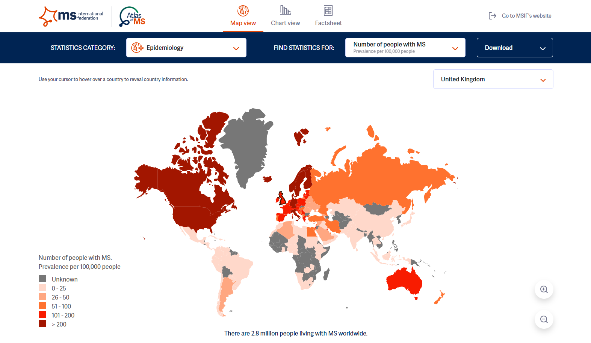
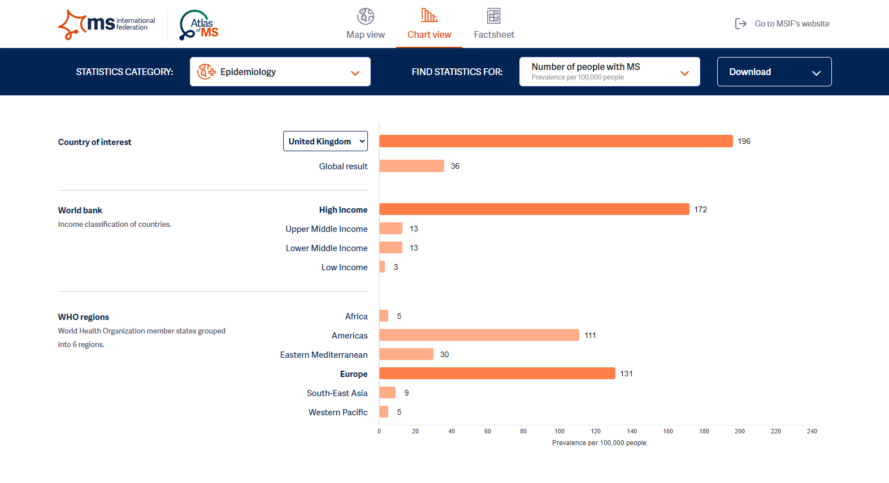
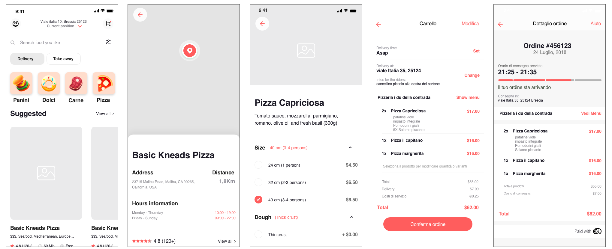

# Full Stack Developer

I have more than 10 years of experience in software application development using Javascript/Typescript, Python, C/C++, C#, and PHP.
Since 2011, I have being worked on software applications and participated in many startups and companies to implement their business ideas. I am very skilled in web and mobile application development and have good working experiences for them. Especially I am very experienced in Javascript/Typescript and I have special background in JS-based frameworks including React.js, React Native, Angular.js, Ionic, etc.

In recent years, I am focusing on Blockchain Cryptocurrency projects. DeFi is my passion and I have developed several DeFi products such as wrapped coin, stablecoin, asset staking, Dex, Lending platform on Ethereum and Tron. I have deep knowledge and strong experience with 0x, AMP, MakerDAO, Uniswap protocols and Solidity, truffle, Waffle, HardHat.

## Portfolio

### Kryptomon - Blockchain

### MSIF - Web/PHP/React/Nivo

### Deliveroo - Mobile/React Native

## Experienced Areas
- Javascript/Typescript, PHP, Python, C#, C/C++
- Web Development: React.js, Angular.js, Next.js, Node.js, Laravel, Django, etc
- Hybrid Mobile App Development: React Native, Ionic, NativeScript
- Blockchain: Ethereum, Bitcoin, SiaCoin, Smart Contract, ERC20/ERC721 Token, Defi, Uniswap, DEX, dApp, Web3, Ethers.js, Truffle, Waffle, HardHat
- CI/CD & Automated Testing: Unit Testing & E2E Testing
- Cloud Services: Firebase, AWS
- 3rd Party SDK: Stripe, Twilio, MailChimp, SendGrid, Google, Twitter, Facebook, Linkedin
- Database: MySQL, MsSQL, PostgreSQL, SQLITE, MongoDB
